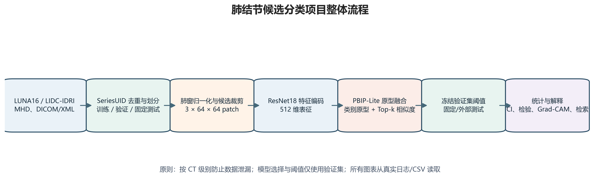
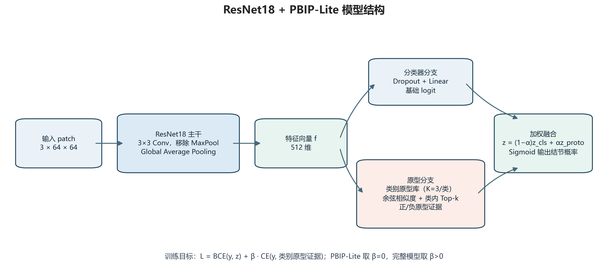
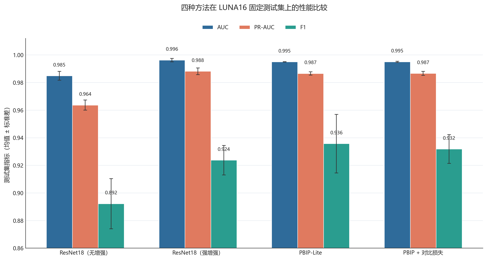
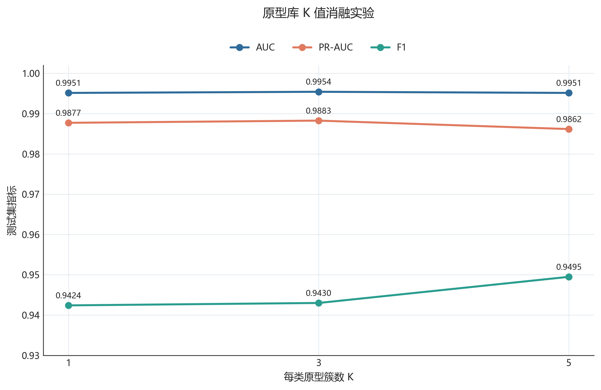
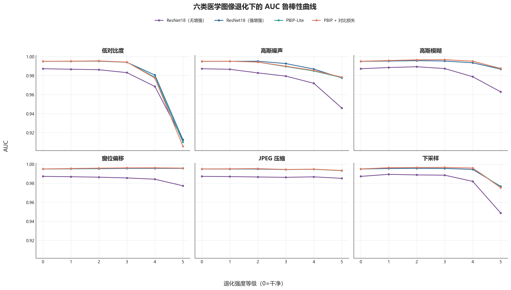
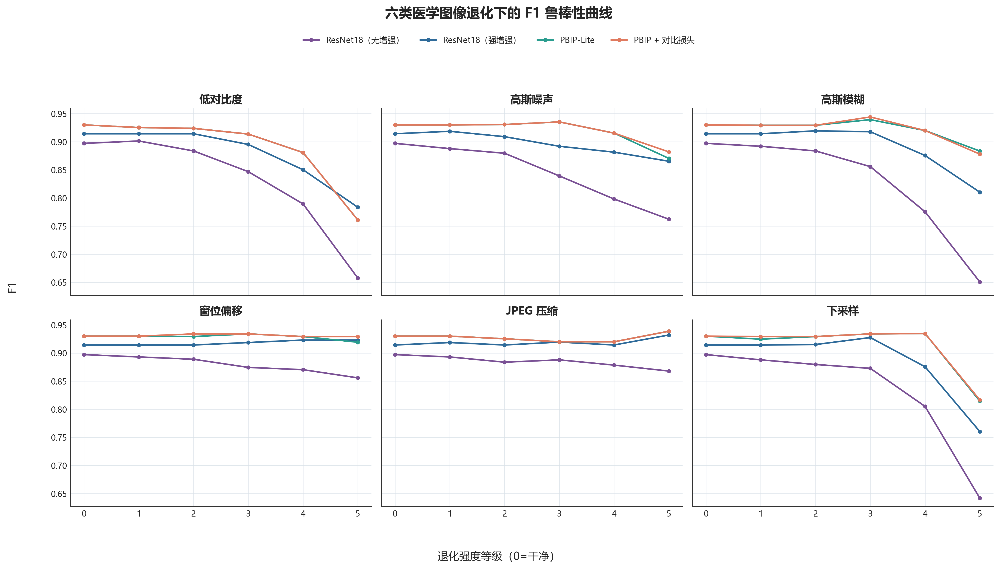
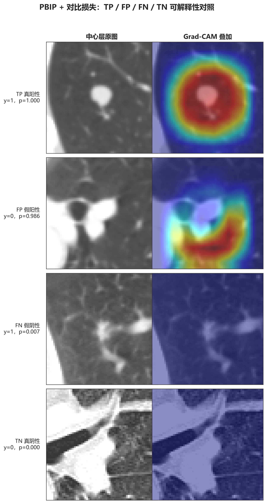
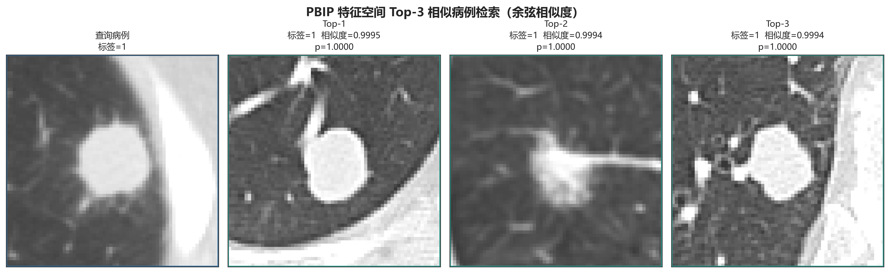

# ResNet18 + PBIP-Lite 肺结节候选分类项目完整技术报告

**报告版本**：V3.0  
**完成日期**：2026-07-22  
**任务类型**：候选级肺结节二分类、固定测试、统计分析、可解释性、鲁棒性与工程化验证  
**数据声明**：本文所有数值均从项目实际 CSV、JSON、checkpoint 推理或日志读取；没有为补齐表格而生成模拟实验数据。

## 摘要

本项目面向 LUNA16/LIDC-IDRI `.mhd` 医学影像，构建了以 ResNet18 为主干、PBIP-Lite 原型学习为增强模块的肺结节候选分类工程。系统采用相邻三张轴位切片组成的 2.5D patch，经肺窗裁剪与归一化后输入轻量化 ResNet18；PBIP-Lite 在 512 维特征空间中建立正、负类别原型库，用余弦相似度形成原型证据，并与基础分类 logit 融合。完整版本进一步加入类别感知原型对比损失。

工程完成了四方法三随机种子主实验、K/β/组件消融、六类五档退化评估、Grad-CAM、Top-3 检索、LIDC-IDRI 可用性审计、LUNA16 固定测试、CT 簇 Bootstrap 95% 置信区间和多种统计检验。固定测试结果显示，强增强 ResNet18 的平均 AUC/PR-AUC 最高，分别为 **0.99625 ± 0.00125** 和 **0.98814 ± 0.00244**；PBIP-Lite 的平均 F1 最高，为 **0.93569 ± 0.02123**。但在仅有三个配对随机种子的条件下，五项指标的配对 t 检验、Welch 双样本 t 检验及 Wilcoxon 符号秩检验均未达到 `p < 0.05`，因此不宣称两者总体性能存在统计显著差异。

当前本地 LIDC-IDRI 仅有 1 个独立 CT、12 个正例 patch 和 0 个负例，不满足去重后独立二分类与 CT 簇 Bootstrap 条件；流程按预设规则自动回退到包含 87 个 CT、497 个候选的 LUNA16 固定测试集。最终一键冒烟测试使用真实 `.mhd`、实际 checkpoint 与原型库，完整通过“加载 → 推理 → 评估 → 统计 → 绘图”，总耗时 2.9562 秒。

## 1. 项目背景与目标

低剂量 CT 中的肺结节通常尺寸较小，邻近血管、胸膜和瘢痕可能造成高相似度假阳性。候选检测器追求较高灵敏度时会产生大量可疑坐标，候选分类器的任务是在尽量保留真结节的同时压低假阳性，从而减少读片负担。

常规深度网络能学习强判别特征，但仍存在四个实际痛点：

1. **类别不平衡与难负例**：非结节候选显著多于结节，且血管交叉等样本外观接近结节；
2. **决策证据不可追溯**：单一分类概率难以说明网络关注区域，也无法指出相似训练病例；
3. **域偏移与图像退化**：扫描协议、噪声、重建、窗位和压缩差异会改变输入分布；
4. **评估口径容易混淆**：候选分类、完整候选检测和官方 FROC 并非同一任务，CT 内样本也不是相互独立。

本项目的目标是建立一套可复现、可审计的候选级分类流程：用 ResNet18 获得稳定基线，用 PBIP-Lite 引入正负类别原型证据，用 Grad-CAM 与病例检索补充解释，并用固定划分、三随机种子、CT 簇 Bootstrap 和差异检验约束结论强度。完整研究综述见 [`docs/background_and_related_work.md`](docs/background_and_related_work.md)。

## 2. 数据与预处理

### 2.1 数据来源与固定划分

LUNA16 原始 CT 由 `.mhd` 头文件和对应体素数据构成。SimpleITK 负责读取体数据的 origin、spacing、direction 与像素类型。候选世界坐标先转换到体素坐标，再从中心层及前后相邻层抽取 `3×64×64` patch。

预处理保留全部正候选，并按固定随机种子把负候选限制在约 1:3。划分以 CT/`seriesuid` 为最小单位，subset 0–7 用于训练、subset 8 用于模型/阈值选择、subset 9 作为固定测试集，避免同一 CT 的候选跨集合泄漏。

**表 1　当前处理数据与固定划分统计**

| 集合 | 候选数 | 正例 | 负例 | CT 数 | 用途 |
|---|---:|---:|---:|---:|---|
| 训练集 | 3553 | 916 | 2637 | 689 | 参数学习与原型库构建 |
| 验证集 | 462 | 114 | 348 | 87 | checkpoint 和阈值选择 |
| 固定测试集 | 497 | 98 | 399 | 87 | 锁定后的最终评价 |
| 合计 | 4512 | 1128 | 3384 | 863 | 当前处理数据版本 |

### 2.2 标注、肺窗与 patch

候选与标注中心的欧氏距离不超过 5 mm 时标为正例。默认肺窗宽度为 1500 HU、窗位为 -600 HU，因此裁剪边界为 `[-1350, 150]` HU。归一化为：

$$
x_{norm}=\frac{\operatorname{clip}(x,-1350,150)+1350}{1500}.
$$

候选中心层索引为 $i_z$ 时，输入为：

$$
\mathbf X=\operatorname{stack}(S_{i_z-1},S_{i_z},S_{i_z+1})
\in\mathbb R^{3\times64\times64}.
$$

CT 首尾层通过合法索引裁剪处理，平面边界使用 0 HU 补齐。patch 保存为 `float32 .npy`，推理必须复用相同预处理，不能直接输入未窗化的原始 HU。



## 3. 技术方法

### 3.1 ResNet18 主干

主干采用 torchvision ResNet18，但针对 `64×64` 小尺寸医学 patch 做两项修改：首个 `7×7, stride=2` 卷积替换为 `3×3, stride=1`，并移除初始最大池化。四个残差阶段仍为 `[2,2,2,2]` BasicBlock；全局平均池化后得到 512 维特征，经过 Dropout 0.3 和线性层输出基础 logit $b(\mathbf X)$。

### 3.2 PBIP-Lite 原型库

对每个随机种子，先使用该种子最优强增强 ResNet18 对训练集提取 L2 归一化特征。正、负两类分别在单位球面执行 $K=3$ 的球面 K-means，每簇保留距离中心最近的 $N=20$ 个真实训练样本作为可追溯原型，而不是保存不可解释的合成中心。

对于查询特征 $\mathbf z$ 与类别 $c$ 的原型 $\mathbf p_{c,j}$，余弦相似度为：

$$
s_{c,j}=\frac{\mathbf z^\top\mathbf p_{c,j}}
{\lVert\mathbf z\rVert_2\lVert\mathbf p_{c,j}\rVert_2}.
$$

每类取 Top-k 相似度形成类别证据 $q_c$，再用温度 $\tau=0.2$ 得到原型 logit。二分类原型差分 $r(\mathbf X)$ 与基础 logit 融合：

$$
\ell(\mathbf X)=(1-\alpha)b(\mathbf X)+\alpha r(\mathbf X),
\qquad \alpha=0.3.
$$

纯 PBIP-Lite 只执行上述轻量融合，不要求额外对比训练；PBIP 完整版本在同一结构上增加原型损失。



### 3.3 损失函数

基础分类损失使用带 logits 的二元交叉熵：

$$
\mathcal L_{BCE}=-\frac{1}{B}\sum_{i=1}^{B}
\left[y_i\log\sigma(\ell_i)+(1-y_i)\log(1-\sigma(\ell_i))\right].
$$

类别感知原型损失把正负类别证据作为两类 logits：

$$
\mathcal L_{proto}=-\frac{1}{B}\sum_{i=1}^{B}
\log\frac{\exp(q_{i,y_i})}{\exp(q_{i,0})+\exp(q_{i,1})}.
$$

总损失为：

$$
\boxed{\mathcal L=\mathcal L_{BCE}+\beta\mathcal L_{proto}}.
$$

其中 PBIP-Lite 取 $\beta=0$，PBIP 完整版本取 $\beta=0.05$。该损失是类别感知原型证据交叉熵，不应误写为显式构造正负样本对的标准监督对比损失。

### 3.4 训练和阈值协议

每个 seed 依次训练无增强 ResNet18、强增强 ResNet18、PBIP-Lite 和 PBIP 完整版本。checkpoint 只按验证 AUC 选择；原型库只使用同 seed 训练特征，不能跨 seed 共用。正式分类阈值只在验证集最大化 F1：

$$
t^*=\arg\max_{t\in\mathcal T_{val}}
F_1(y_{val},\mathbb I[p_{val}\ge t]),
$$

随后将 $t^*$ 冻结到固定测试集。测试标签不参与阈值选择。

**表 2　核心方法超参数**

| 类别 | 参数 | 取值 |
|---|---|---:|
| 预处理 | patch / 窗宽 / 窗位 | `3×64×64` / 1500 / -600 HU |
| 采样 | 正负比例上限 / 随机种子 | 1:3 / 42 |
| ResNet18 | 特征维数 / Dropout | 512 / 0.3 |
| 原型库 | 每类簇数 K / 每簇代表数 N | 3 / 20 |
| 原型推理 | Top-k / 温度 τ / 融合 α | 20 / 0.2 / 0.3 |
| 训练 | epochs / batch size | 20 / 64 |
| ResNet18 | 学习率 / weight decay | `1e-3` / `1e-4` |
| PBIP | 学习率 / weight decay | `1e-4` / `1e-4` |
| 损失 | β | 0 或 0.05 |
| 重复实验 | seeds | 0、1、2 |
| 统计 | Bootstrap / 置信水平 | 1000 / 95% |

完整伪代码、增强参数和 YAML 样例见 [`docs/methodology.md`](docs/methodology.md) 与 [`docs/config_samples/`](docs/config_samples/)。

## 4. 实验环境与评价设置

**表 3　实际运行环境**

| 项目 | 版本/配置 |
|---|---|
| 操作系统 | Windows 10.0.26200，64 位 |
| Python | 3.10.20（conda-forge） |
| PyTorch / torchvision | 2.11.0+cu130 / 0.26.0+cu130 |
| CUDA / GPU | CUDA 13.0 / NVIDIA GeForce RTX 4060 Laptop GPU |
| NumPy / pandas / SciPy | 2.2.6 / 2.3.3 / 1.15.3 |
| scikit-learn / statsmodels | 1.7.2 / 0.14.6 |
| SimpleITK / OpenCV / Pillow | 2.5.5 / 4.12.0.88 / 12.2.0 |
| Matplotlib | 3.10.9 |

分类评价指标为 Accuracy、Precision、Recall、F1、ROC-AUC 和 PR-AUC。主实验以 Seed 0/1/2 的均值与样本标准差汇总。固定测试 95% CI 按 CT/`seriesuid` 进行 1000 次有放回簇重采样，而不是逐候选重采样；这保留了同一 CT 内候选相关性。

方法差异同时报告：同 seed 的配对 t 检验、作为敏感性分析的 Welch 双样本 t 检验，以及非参数 Wilcoxon 符号秩检验。显著性阈值为 $\alpha=0.05$。由于只有三个随机种子，统计功效有限，p 值必须与效应方向和方差一起解释。

六类退化包括低对比度、高斯噪声、高斯模糊、窗位偏移、JPEG 压缩和下采样/重采样；每类设置 1–5 档，验证集确定的阈值在退化测试中保持不变。Grad-CAM 使用 TP、FP、FN、TN 四类样本；检索返回余弦相似度最高的三个训练病例原型。

## 5. 实验结果

### 5.1 四方法三随机种子主实验

**表 4　LUNA16 固定测试集主结果（均值 ± 标准差）**

| 方法 | AUC | PR-AUC | F1 | Accuracy | Precision | Recall |
|---|---:|---:|---:|---:|---:|---:|
| ResNet18，无增强 | 0.98485 ± 0.00321 | 0.96364 ± 0.00368 | 0.89218 ± 0.01817 | 0.95439 ± 0.00813 | 0.83697 ± 0.02867 | 0.95578 ± 0.02124 |
| ResNet18，强增强 | **0.99625 ± 0.00125** | **0.98814 ± 0.00244** | 0.92373 ± 0.01068 | 0.96848 ± 0.00506 | 0.88552 ± 0.02776 | **0.96599 ± 0.01178** |
| PBIP-Lite，β=0 | 0.99500 ± 0.00008 | 0.98654 ± 0.00118 | **0.93569 ± 0.02123** | **0.97384 ± 0.00922** | 0.91417 ± 0.04386 | 0.95918 ± 0.01020 |
| PBIP + 原型损失，β=0.05 | 0.99502 ± 0.00041 | 0.98661 ± 0.00149 | 0.93178 ± 0.01045 | 0.97250 ± 0.00506 | **0.91643 ± 0.03934** | 0.94898 ± 0.02041 |

强增强使 ResNet18 相较无增强基线获得明显的排序性能提升。PBIP-Lite 的 AUC 略低于强增强 ResNet18，但平均 F1、Accuracy 和 Precision 更高，说明在验证阈值协议下，原型证据改变了操作点附近的分类权衡。完整原型损失没有在三种主指标上稳定超过纯融合版，因此不能将 β=0.05 表述为全面改进。



### 5.2 消融实验

消融使用 Seed 0，用于验证原型组件、K 和 β 的局部敏感性。所有值来自 [`runs/summary_v3/tables/ablation_results_table.csv`](runs/summary_v3/tables/ablation_results_table.csv)。

**表 5　PBIP 组件、K 与 β 消融结果**

| 组别 | 配置 | AUC | PR-AUC | F1 |
|---|---|---:|---:|---:|
| 组件 | 移除原型对比损失（β=0） | 0.995013 | 0.987585 | 0.917874 |
| 组件 | 移除原型 logit（α=0） | 0.994681 | 0.987379 | 0.937500 |
| K | K=1 | 0.995141 | 0.987722 | 0.942408 |
| K | K=3 | **0.995422** | **0.988266** | 0.943005 |
| K | K=5 | 0.995141 | 0.986170 | **0.949495** |
| β | β=0.01 | 0.994860 | 0.986212 | 0.931373 |
| β | β=0.05 | 0.995422 | 0.988266 | **0.943005** |
| β | β=0.10 | **0.995831** | **0.988486** | 0.938144 |
| β | β=0.20 | 0.994553 | 0.986280 | 0.930693 |

K=3 的 AUC/PR-AUC 最佳，K=5 的 F1 最高，差异幅度较小；项目采用 K=3 是兼顾排序性能、原型库规模与可解释性的工程折中。β=0.10 获得最高 AUC，但 β=0.05 的 F1 更高；单 seed 消融不足以证明最优超参数具有普适性。



### 5.3 六类图像退化鲁棒性

下表汇总最高退化等级 Level 5 在六类退化上的宏平均；阈值保持为各模型干净验证集阈值。

**表 6　Level 5 六类退化宏平均结果**

| 方法 | AUC | PR-AUC | F1 | 相对干净 AUC 下降 | 相对干净 F1 下降 |
|---|---:|---:|---:|---:|---:|
| ResNet18，无增强 | 0.955420 | 0.893682 | 0.739364 | 0.031818 | 0.157833 |
| ResNet18，强增强 | **0.973795** | **0.942594** | 0.845780 | **0.021141** | 0.068506 |
| PBIP-Lite | 0.973458 | 0.938731 | 0.864546 | 0.021606 | 0.065454 |
| PBIP + 原型损失 | 0.972708 | 0.937752 | **0.867592** | 0.022330 | **0.062408** |

强增强 ResNet18 在 Level 5 的宏平均 AUC/PR-AUC 最佳；PBIP 完整版的 F1 及 F1 衰减最佳。无增强基线退化最明显，说明训练增强对高强度分布扰动具有实质作用。详细到“方法 × 退化类型 × 等级”的全部记录见 [`runs/summary_v3/tables/robustness_results_table.csv`](runs/summary_v3/tables/robustness_results_table.csv)。





额外的 Robust-PBIP 在训练中混入六类退化。其 Level 3 结果如下。

**表 7　普通 PBIP 与 Robust-PBIP 的 Level 3 六类退化宏平均**

| 模型 | 场景 | AUC | PR-AUC | F1 |
|---|---|---:|---:|---:|
| PBIP | 干净 | 0.995422 | 0.988266 | **0.943005** |
| PBIP | Level 3 宏平均 | 0.993803 | 0.985759 | **0.941158** |
| Robust-PBIP | 干净 | **0.995678** | 0.987281 | 0.887850 |
| Robust-PBIP | Level 3 宏平均 | **0.995520** | **0.986798** | 0.895622 |

Robust-PBIP 提升了退化宏平均 AUC，但固定阈值下 F1 明显低于普通 PBIP。这提示排序鲁棒性与阈值校准并不等价，部署前需要独立校准，而不能据 AUC 单独宣称所有指标均改善。

### 5.4 LIDC-IDRI 审计与固定测试

自动数据源审计发现：本地 LIDC-IDRI 流程解析了 1319 个 XML，得到 1294 个唯一 XML series 与 20096 条医师级标注；但当前实际提取数据只有 1 个非重叠 CT、12 个正 patch、0 个负 patch。它能证明 DICOM/SOP 对齐与 patch 抽取链路可用，却不能支持独立二分类 AUC/F1 或 CT 簇 Bootstrap。因此正式流程记录回退原因后选择 LUNA16 固定测试集：497 个候选、87 个 CT、98 个正例和 399 个负例。

**表 8　自动选择的 LUNA16 固定测试集三随机种子结果**

| 方法 | Accuracy | Precision | Recall | F1 | AUC |
|---|---:|---:|---:|---:|---:|
| ResNet18，强增强 | 0.96848 ± 0.00506 | 0.88552 ± 0.02776 | **0.96599 ± 0.01178** | 0.92373 ± 0.01068 | **0.99625 ± 0.00125** |
| PBIP-Lite | **0.97384 ± 0.00922** | **0.91417 ± 0.04386** | 0.95918 ± 0.01020 | **0.93569 ± 0.02123** | 0.99500 ± 0.00008 |

每个 seed、每个指标的 1000 次 CT 簇 Bootstrap 95% CI 均保存在 [`runs/summary_v3/tables/external_test_results_table.csv`](runs/summary_v3/tables/external_test_results_table.csv)，数据源选择与回退证据保存在 [`runs/external_test/data_source_manifest.json`](runs/external_test/data_source_manifest.json)。这些结果应称为“LUNA16 固定测试”，而不是“完整 LIDC-IDRI 外部验证”。

### 5.5 统计显著性

**表 9　强增强 ResNet18 与 PBIP-Lite 的 p 值（n=3 seeds）**

| 指标 | 配对 t 检验 | Welch 双样本 t 检验 | Wilcoxon 符号秩检验 | `p<0.05` |
|---|---:|---:|---:|---|
| Accuracy | 0.528595 | 0.440031 | 0.750000 | 否 |
| Precision | 0.501514 | 0.402323 | 0.500000 | 否 |
| Recall | 0.634852 | 0.492572 | 1.000000 | 否 |
| F1 | 0.532834 | 0.448566 | 0.750000 | 否 |
| AUC | 0.232405 | 0.223436 | 0.500000 | 否 |

最小 p 值为 AUC 的 Welch 检验 `p=0.223436`，仍高于 0.05。配对 t 检验更符合相同 seed 的实验设计，Welch 结果仅作为补充。三 seed 的小样本使正态性与检验功效都有限；Wilcoxon 也只能产生较粗的离散 p 值。因此当前证据支持“指标侧重点不同”，不支持“PBIP 或 ResNet18 在总体上显著优于另一方”。

### 5.6 Grad-CAM 与病例检索

解释性导出覆盖强增强 ResNet18 与 PBIP 完整版。ResNet18 含 TP/FP/FN/TN 样本数 3/3/2/3，PBIP 完整版为 3/3/3/3。热图显示模型在不同决策类型下的高响应区域，但 Grad-CAM 不是病灶分割掩膜，不能据此计算边界、体积或临床定位准确率。

**表 10　解释性样本覆盖与检索记录**

| 模块 | 方法/查询 | 实际记录 | 结论边界 |
|---|---|---:|---|
| Grad-CAM | 强增强 ResNet18 | TP 3、FP 3、FN 2、TN 3 | 定性关注区域 |
| Grad-CAM | PBIP + 原型损失 | TP 3、FP 3、FN 3、TN 3 | 定性关注区域 |
| Top-3 检索 | PBIP 查询病例 | 3 个同类正原型 | 相似度证据，不等于病理诊断 |
| Top-3 余弦相似度 | 排名 1/2/3 | 0.999453 / 0.999433 / 0.999395 | 当前特征空间内的近邻 |





## 6. 工程化实现与一键验证

工程入口和依赖固定在 [`README.md`](README.md)、[`requirements.txt`](requirements.txt) 与 [`smoke_test.py`](smoke_test.py)。`smoke_test.py` 默认读取真实 LUNA16 `.mhd`，从验证/测试集合各抽取 32 个类别平衡候选，加载 Seed 1 PBIP checkpoint 和同 seed 原型库，在验证子集选择阈值后进行测试推理，再执行 200 次 CT 簇 Bootstrap 并输出 300 DPI 诊断图。

本次实际命令为：

```powershell
.\.venv\Scripts\python.exe smoke_test.py
```

**表 11　2026-07-22 一键冒烟测试记录**

| 阶段/指标 | 结果 | 95% CI 或说明 |
|---|---:|---|
| 加载 | PASS，0.1104 s | 真实 `.mhd` 可读；val/test 各 32 候选 |
| 推理 | PASS，1.9504 s | PBIP；验证阈值 0.201779；验证 F1 0.969697 |
| 评估 | PASS，0.0139 s | 测试 29 个 CT，正/负各 16 |
| 统计 | PASS，0.8295 s | 200 次 CT 簇 Bootstrap |
| 绘图 | PASS，0.0245 s | `1240×840` PNG，约 300 DPI |
| Accuracy | 0.937500 | [0.818040, 1.000000] |
| Precision | 0.937500 | [0.785714, 1.000000] |
| Recall | 0.937500 | [0.811924, 1.000000] |
| F1 | 0.937500 | [0.823312, 1.000000] |
| AUC | 0.996094 | [0.968618, 1.000000] |
| PR-AUC | 0.996324 | 点估计 |
| 总状态/耗时 | **PASS / 2.9562 s** | 工程冒烟，不作科学结论 |

结构化证据位于 [`runs/smoke_test/latest/summary.json`](runs/smoke_test/latest/summary.json)、[`runs/smoke_test/latest/step_status.csv`](runs/smoke_test/latest/step_status.csv) 和 [`runs/smoke_test/latest/bootstrap_ci.csv`](runs/smoke_test/latest/bootstrap_ci.csv)，日志模板见 [`docs/SMOKE_TEST_LOG_TEMPLATE.md`](docs/SMOKE_TEST_LOG_TEMPLATE.md)。小样本经过有意类别平衡，指标不能替代 497 候选完整测试。

## 7. 模型与实验局限性

1. **Sampled-Candidate FROC 限制**：负候选在预处理阶段被抽样为约 1:3，现有 FROC 只衡量被保留候选上的阈值轨迹。官方 LUNA16 FROC 要求从完整扫描产生所有候选、做结节匹配并以每扫描假阳性统计；两者不可直接比较，现有 CPM 也只能称 sampled-candidate CPM。
2. **尚无完整独立 LIDC-IDRI 性能**：本地仅 1 个 CT 且只有正候选，不能计算 AUC、特异度或有效 CT 簇 CI。需要下载完整 DICOM、建立跨医师共识和独立负候选协议后才能完成真正外部验证。
3. **2.5D 表达限制**：三张轴位切片计算量低，但不能完整利用三维形态；当前流程也没有把所有扫描统一重采样到各向同性体素，层厚差异可能改变跨层上下文。
4. **原型库依赖特征版本**：checkpoint 与原型库必须同 seed、同主干、同预处理；主干更新后旧原型会失配。静态原型库也可能无法代表新增中心或设备数据。
5. **随机种子数量有限**：三 seed 可以估计初步波动，却不足以稳定估计小效应或检验正态性。当前“不显著”不等于方法完全等价。
6. **阈值和校准**：验证集最大 F1 阈值受类别比例影响，换中心或患病率后应独立校准。Robust-PBIP 的 AUC/F1分歧已显示排序改善不保证固定阈值表现改善。
7. **解释性仍以定性为主**：Grad-CAM 未与放射科分割或眼动关注区域做定量比较；Top-3 高相似度仅说明表征接近，不能证明因果或病理一致。
8. **退化模型不是完整临床域偏移**：六种合成退化覆盖常见成像变化，但不能替代不同医院、厂商、剂量、重建核和人群构成的前瞻性验证。
9. **候选级而非端到端系统**：模型依赖已有候选坐标，真实部署还需要上游候选生成、DICOM 接入、失败恢复、延迟监控和临床工作流验证。

## 8. 结论

本项目完成了从 `.mhd` 数据读取、候选 patch 预处理、ResNet18/PBIP-Lite 训练，到固定测试、统计检验、解释性、退化鲁棒性、表图导出和工程冒烟测试的闭环实现。结果表明，强增强 ResNet18 已是非常强的排序基线；PBIP-Lite 在保持接近 AUC/PR-AUC 的同时提高了平均 F1、Accuracy 和 Precision，并提供可检索的原型证据。但三 seed 统计未显示五项指标存在显著差异，完整原型损失也没有全面胜过轻量融合，因此报告采用克制结论。

工程层面，自动外部数据审计避免了将不完整 LIDC-IDRI 样本误报为外部验证；CT 簇 Bootstrap 更符合扫描内候选相关结构；一键冒烟测试已用真实数据和模型验证全流程可运行。下一阶段优先级应是：获得完整、严格去重的独立 LIDC-IDRI 二分类队列；增加随机种子与多中心评估；实现全候选端到端官方 FROC；对模型概率做外部校准；并用放射科标注定量验证解释性。

## 9. 内容检查记录

**表 12　全文与工程交付检查记录**

| 检查项 | 核对依据 | 状态 | 记录 |
|---|---|---|---|
| 项目背景与核心痛点 | 第 1 节、相关工作文档 | PASS | 四方向与任务边界已说明 |
| SimpleITK、1:3、肺窗预处理 | 第 2 节、`src/preprocess.py` | PASS | 参数与当前数据统计一致 |
| ResNet18 与 PBIP-Lite 结构 | 第 3 节、图 2 | PASS | 公式、融合与原型库已说明 |
| BCE + 类别感知原型损失 | 第 3.3 节 | PASS | 已区分标准 SupCon |
| 超参数与训练/阈值协议 | 表 2、方法文档、YAML | PASS | 禁止测试集调阈值 |
| 主实验四方法三 seed | 表 4、主结果 CSV | PASS | 均值与标准差由实际 CSV 读取 |
| 消融实验 | 表 5、图 4 | PASS | 组件、K、β 均覆盖 |
| 六类退化鲁棒性 | 表 6–7、图 5–6 | PASS | 已陈述 AUC/F1 权衡 |
| 外部/固定测试与 95% CI | 第 5.4 节、外部表 CSV | PASS | LIDC 不可用原因与回退已记录 |
| t 检验与 Wilcoxon | 表 9、统计 CSV | PASS | 15 项检验均保留 p 值 |
| Grad-CAM 与 Top-3 检索 | 表 10、图 7–8 | PASS | 未把定性图当定量定位 |
| Sampled-Candidate FROC 限制 | 第 7 节 | PASS | 已与官方 LUNA16 FROC 区分 |
| README 与精确依赖版本 | 根目录交付文件 | PASS | 安装、数据、命令、推理齐全 |
| 一键冒烟测试 | 表 11、`summary.json` | PASS | 五阶段通过，退出码 0 |
| CSV/PNG/SVG/Markdown 产物 | `runs/`、`paper_figs/task3/` | PASS | 表、图和文档格式满足要求 |
| 数据真实性 | 源 CSV/JSON/日志交叉核对 | PASS | 未捏造 LIDC 外部性能或缺失实验值 |

## 参考文献

1. Setio AAA, et al. Pulmonary nodule detection in CT images: false positive reduction using multi-view convolutional networks. *IEEE Transactions on Medical Imaging*, 2016.
2. Setio AAA, et al. Validation, comparison, and combination of algorithms for automatic detection of pulmonary nodules in computed tomography images: The LUNA16 challenge. *Medical Image Analysis*, 2017.
3. Armato SG III, et al. The Lung Image Database Consortium (LIDC) and Image Database Resource Initiative (IDRI): a completed reference database of lung nodules on CT scans. *Medical Physics*, 2011.
4. He K, Zhang X, Ren S, Sun J. Deep residual learning for image recognition. *CVPR*, 2016.
5. Snell J, Swersky K, Zemel R. Prototypical networks for few-shot learning. *NeurIPS*, 2017.
6. Selvaraju RR, et al. Grad-CAM: Visual explanations from deep networks via gradient-based localization. *ICCV*, 2017.
7. Guo C, Pleiss G, Sun Y, Weinberger KQ. On calibration of modern neural networks. *ICML*, 2017.
8. Efron B, Tibshirani RJ. *An Introduction to the Bootstrap*. Chapman & Hall/CRC, 1993.
9. Wilcoxon F. Individual comparisons by ranking methods. *Biometrics Bulletin*, 1945.
10. DeLong ER, DeLong DM, Clarke-Pearson DL. Comparing the areas under two or more correlated ROC curves. *Biometrics*, 1988.

更完整的经典与近年参考文献清单见 [`docs/background_and_related_work.md`](docs/background_and_related_work.md)。
